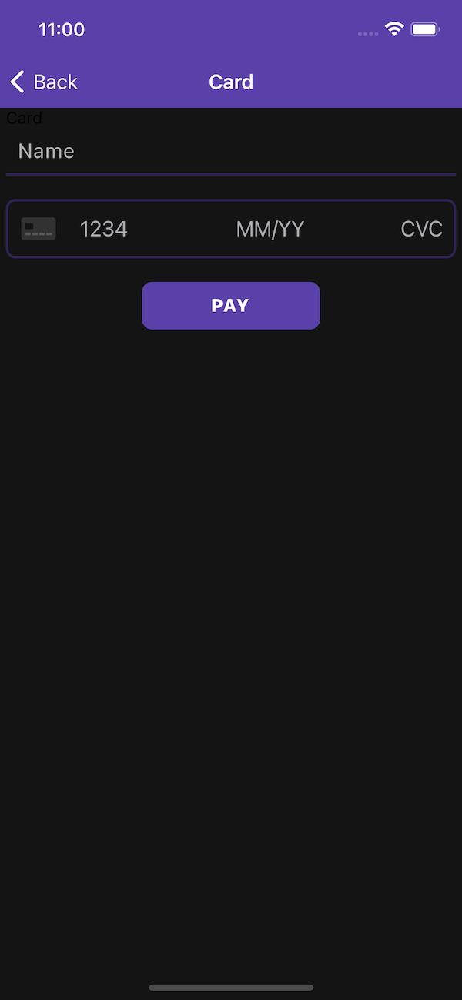

This is a how-to on integrating stripe with a react native app. I recently tried this out and learned some things along the way. Hopefully, this will help you guys integrate it and not leave you confused as I was while I was trying to figure it out.

[Stripe](https://stripe.com/docs) is a SaaS that offers an easy to plugin way to accept payments to your app/website. Stripe allows you to user their software to accept payments and grow your business without the overhead of managing all of that on your own.

Let's get to it 🤟

## Create a stripe account

In order to use stripe in our application, we will need to create an account with them so that we have the required access keys needed.

Go to [https://dashboard.stripe.com/register](https://dashboard.stripe.com/register) to create an account. Next, you need to get your private keys. From the dashboard, you can click on Developers in the upper right part of the screen, then click on API Keys on the left side of the screen. You will now see a publishable key and secret key. You will need these later.

## Installation

```
$ npx react-native init stripeExample
```

We need to install some packages first to help get us started. I'll breeze through this part. If you have trouble refer to the documentation. `cd` into the project folder and let's install these packages.

### navigation

These will be used for basic navigation. Refer to the [react-navigation docs](https://reactnavigation.org/docs/getting-started/)

```
$ yarn add @react-navigation/native react-native-screens react-native-safe-area-context @react-navigation/native-stack
```

run `pod install` in `ios` directory

### stripe

[React native stripe docs](https://github.com/stripe/stripe-react-native)

```
yarn add @stripe/stripe-react-native
```

run `pod install` in `ios` directory

##### trouble shooting ios errors

###### errors after installing with npm

If you were to build your app now, you would get some errors. We need to make some changes in ios to fix these errors. Open `stripeExample.xcworkspace` in xcode and and go to Build Settings and set 'iOS Deployment Target' to iOS 11.0.

Now open `podfile` and update line 4 to read `platform :ios, '11.0'`.

###### errors with x86_64 mac

If you're still getting an error you can reference this [fix](https://github.com/stripe/stripe-react-native/#undefined-symbols-for-architecture-x86_64-on-ios) to resolve the error.
The steps to fix are listed below:

> Open your project via Xcode, go to project -> build settings, find library search paths and remove all swift related entries such as: $(TOOLCHAIN_DIR)/usr/lib/swift/$(PLATFORM_NAME) and $(TOOLCHAIN_DIR)/usr/lib/swift-5.0/$(PLATFORM_NAME).
>
> Create a new Swift file to the project (File > New > File > Swift), give it any name (e.g. Fix.swift) and create a bridging header when prompted by Xcode.

###### RCTBridge error

If you encouter some sort of RTCBridge error, you will need to make some changes to your ios code. The changes below fixed the problem for me. You can refer to this [issue](https://github.com/facebook/react-native/issues/16376#issuecomment-810094592) on github if it doesn't work for you.

AppDelegate.h

```
#import "AppDelegate.h"
// NEW CODE

#if RCT_DEV
#import <React/RCTDevLoadingView.h>
#endif

// END
```

AppDelegate.m

```
- (BOOL)application:(UIApplication *)application didFinishLaunchingWithOptions:(NSDictionary *)launchOptions
{
  RCTBridge *bridge = [[RCTBridge alloc] initWithDelegate:self launchOptions:launchOptions];
  // NEW CODE

  #if RCT_DEV
   [bridge moduleForClass:[RCTDevLoadingView class]];
  #endif

  // END

  RCTRootView *rootView = [[RCTRootView alloc] initWithBridge:bridge
                                                   moduleName:@"TempleWallet"
                                            initialProperties:nil];
  ...
```

Now let's run our app. You should be able to build the app successfully at this point. 🤓

`$ react-native run-ios`

## Building the app

Now that we've got all the set-up and installation out the way we can start building out the app.  
Let's start by creating a simple home screen that will have a button that we can press to initiate the payment process. At the root of the project create `src > screens > HomeScreen.js`.  
Copy and past this into `HomeScreen.js`:

```javascript
// HomeScreen.js
import React from "react"
import { View, Text, StatusBar, Pressable, StyleSheet } from "react-native"

export default function HomeScreen() {
  return (
    <View style={styles.container}>
      <StatusBar barStyle="light-content" />
      <Pressable
        style={styles.button}
        onPress={() => alert("Todo: Navigate to payment screen")}
      >
        <Text style={styles.label}>Buy</Text>
      </Pressable>
    </View>
  )
}

const styles = StyleSheet.create({
  container: {
    flex: 1,
    alignItems: "center",
    justifyContent: "center",
    backgroundColor: "#141414",
  },
  button: {
    borderRadius: 8,
    width: 150,
    padding: 8,
    alignItems: "center",
    justifyContent: "center",
    backgroundColor: "#5941A9",
    height: 40,
  },
  label: {
    fontSize: 15,
    fontWeight: "800",
    letterSpacing: 1,
    textTransform: "uppercase",
    color: "#fff",
  },
})
```

- Basically, all we are doing is creating a button (`Pressable`) that will naviagte us to the payment screen.

Before we create the next screen, let's create some navigation so that we will actually be able to navigate to that screen.  
Create `src > utils > Navigation.js`. Edit `Navigation.js` to look like the following:

```javascript
// Navigation.js
import React from "react"
import { NavigationContainer } from "@react-navigation/native"
import { createNativeStackNavigator } from "@react-navigation/native-stack"

import HomeScreen from "../screens/HomeScreen"
import CardScreen from "../screens/CardScreen"

export default function Navigation() {
  const RootStack = createNativeStackNavigator()
  const RootStackScreen = () => (
    <RootStack.Navigator>
      <RootStack.Screen
        name="Home"
        component={HomeScreen}
        options={{ headerShown: false }}
      />
      <RootStack.Screen
        name="Card"
        component={CardScreen}
        options={{
          headerStyle: { backgroundColor: "#5941A9" },
          headerTintColor: "#fff",
        }}
      />
    </RootStack.Navigator>
  )
  return (
    <NavigationContainer>
      <RootStackScreen />
    </NavigationContainer>
  )
}
```

Change `App.js` to return Navigation instead of HomeScreen.

```javascript
// App.js
import React from "react"
import Navigation from "./src/utils/Navigation"

export default function App() {
  return <Navigation />
}
```

Now that we can navigate between screens, let's create our `CardScreen.js`. This will handle our payment logic and will be where our stripe implementation will be.

`CardScreen.js`

```javascript
// CardScreen.js
import React, { useState } from "react"
import { View, Text, TextInput, Pressable, StyleSheet } from "react-native"
import { CardField } from "@stripe/stripe-react-native"

export default function CardScreen() {
  const [name, setName] = useState("")
  const [cardFocused, setCardFocused] = useState(false)
  const [nameFocused, setNameFocused] = useState(false)

  const handlePayPress = async () => {
    alert("Todo: handlePayPress")
  }

  return (
    <View style={styles.container}>
      <Text>Card</Text>
      <TextInput
        style={[styles.input, nameFocused && { borderBottomColor: "#5941A9" }]}
        placeholder="Name"
        placeholderTextColor="#B8B8B8"
        onChangeText={setName}
        value={name}
        keyboardType="default"
        onFocus={() => {
          setNameFocused(true)
        }}
        onBlur={() => {
          setNameFocused(false)
        }}
      />
      <CardField
        postalCodeEnabled={false}
        style={[styles.cardField, cardFocused && { borderColor: "#5941A9" }]}
        cardStyle={{ textColor: "#fff" }}
        onFocus={focusedField => {
          console.log("focusField", focusedField)
          setCardFocused(true)
        }}
        onBlur={() => {
          setCardFocused(false)
        }}
      />
      <Pressable style={styles.button} onPress={handlePayPress}>
        <Text style={styles.label}>Pay</Text>
      </Pressable>
    </View>
  )
}

const styles = StyleSheet.create({
  container: {
    backgroundColor: "#141414",
    flex: 1,
    paddingHorizontal: 5,
  },
  cardField: {
    height: 50,
    borderColor: "#2F2258",
    borderWidth: 2,
    borderRadius: 8,
    marginVertical: 20,
  },
  text: {
    color: "#fff",
  },
  button: {
    borderRadius: 8,
    width: 150,
    padding: 8,
    alignItems: "center",
    justifyContent: "center",
    backgroundColor: "#5941A9",
    height: 40,
    alignSelf: "center",
  },
  label: {
    fontSize: 15,
    fontWeight: "800",
    letterSpacing: 1,
    textTransform: "uppercase",
    color: "#fff",
  },
  input: {
    color: "#fff",
    borderBottomColor: "#2F2258",
    borderBottomWidth: 2,
    height: 40,
    fontSize: 17,
    letterSpacing: 1,
    paddingHorizontal: 10,
  },
})
```

- `CardField` is a component that comes from Stripe. Stripe gives us access to these components with built in UI so we don't have to do that part.

Now we just need to be able to navigate to our `CardScreen.js` from `HomeScreen.js`
Modify `HomeScreen.js` by adding the `navigation` prop and changing the onPress function to navigate to the Card screen:

```javascript
// HomeScreen.js
import React from "react"
import { View, Text, StatusBar, Pressable, StyleSheet } from "react-native"

export default function HomeScreen({ navigation }) {
  return (
    <View style={styles.container}>
      <StatusBar barStyle="light-content" />
      <Pressable
        style={styles.button}
        onPress={() => navigation.navigate("Card")}
      >
        <Text style={styles.label}>Buy</Text>
      </Pressable>
    </View>
  )
}

const styles = StyleSheet.create({
  container: {
    flex: 1,
    alignItems: "center",
    justifyContent: "center",
    backgroundColor: "#141414",
  },
  button: {
    borderRadius: 8,
    width: 150,
    padding: 8,
    alignItems: "center",
    justifyContent: "center",
    backgroundColor: "#5941A9",
    height: 40,
  },
  label: {
    fontSize: 15,
    fontWeight: "800",
    letterSpacing: 1,
    textTransform: "uppercase",
    color: "#fff",
  },
})
```

Now we should be able to naviagte between the two screens. We still have to implement Stripe, but that will be the next step. Make sure your app is funcitonal before moving on. This is what it should look like:




## Create a server for stripe

We need to create a server that stripe will use so we can communicate between stripe and our react native app.

Create a new folder called `server`. Navigate to the folder and run `$ npm init -y`. After it's set-up, run `$ npm i express body-parser dotenv`.

We also need to install stripe. `$ npm install stripe --save`.

Create `server/server.js` and add this into it:

```javascript
const express = require("express")
const app = express()
const { resolve } = require("path")
// Replace if using a different env file or config
const env = require("dotenv").config({ path: "./.env" })

const stripe = require("stripe")(process.env.STRIPE_SECRET_KEY, {
  apiVersion: "2020-08-27",
  appInfo: {
    // For sample support and debugging, not required for production:
    name: "stripe-samples/accept-a-payment/custom-payment-flow",
    version: "0.0.2",
    url: "https://github.com/stripe-samples",
  },
})

app.use(express.static(process.env.STATIC_DIR))
app.use(
  express.json({
    // We need the raw body to verify webhook signatures.
    // Let's compute it only when hitting the Stripe webhook endpoint.
    verify: function (req, res, buf) {
      if (req.originalUrl.startsWith("/webhook")) {
        req.rawBody = buf.toString()
      }
    },
  })
)

app.get("/", (req, res) => {
  const path = resolve(process.env.STATIC_DIR + "/index.html")
  res.sendFile(path)
})

app.get("/config", (req, res) => {
  console.log(`Request /config`)
  res.send({
    publishableKey: process.env.STRIPE_PUBLISHABLE_KEY,
  })
})

app.post("/create-payment-intent", async (req, res) => {
  const { paymentMethodType, currency } = req.body

  // Each payment method type has support for different currencies. In order to
  // support many payment method types and several currencies, this server
  // endpoint accepts both the payment method type and the currency as
  // parameters.
  //
  // Some example payment method types include `card`, `ideal`, and `alipay`.
  const params = {
    payment_method_types: [paymentMethodType],
    amount: 1999,
    currency: currency,
  }

  // If this is for an ACSS payment, we add payment_method_options to create
  // the Mandate.
  if (paymentMethodType === "acss_debit") {
    params.payment_method_options = {
      acss_debit: {
        mandate_options: {
          payment_schedule: "sporadic",
          transaction_type: "personal",
        },
      },
    }
  }

  // Create a PaymentIntent with the amount, currency, and a payment method type.
  //
  // See the documentation [0] for the full list of supported parameters.
  //
  // [0] https://stripe.com/docs/api/payment_intents/create
  try {
    const paymentIntent = await stripe.paymentIntents.create(params)

    // Send publishable key and PaymentIntent details to client
    res.send({
      clientSecret: paymentIntent.client_secret,
    })
  } catch (e) {
    return res.status(400).send({
      error: {
        message: e.message,
      },
    })
  }
})

app.listen(3000, () =>
  console.log(`Node server listening at http://localhost:3000`)
)
```

- This gives us access to the endpoints that we need to interact with stripe in our app.

Now we need to create a `.env` file inside of the `server` directory. Fill in the values for `STRIPE_SECRET_KEY`, `PRICE`, `STRIPE_PUBLISHABLE_KEY`. For `PRICE` we need to add a product to our stripe dashboard. We do this so all our data is safe in stripe and no one can hack the network request and change the price/amount that we charge someone.

```
STRIPE_SECRET_KEY=secret_key
STATIC_DIR=../
PRICE=price_id
DOMAIN=http://127.0.0.1:3000
STRIPE_PUBLISHABLE_KEY=publishable_key
```

## Implement Stripe

Now that we have our app built out, we need to integrate stripe into our application so we can make payments to stripe.

Modify `App.js`

```javascript
import React, { useState, useEffect } from "react"
import { StripeProvider } from "@stripe/stripe-react-native"

import Navigation from "./src/utils/Navigation"
import { fetchPublishableKey } from "/src/utils/helpers"

export default function App() {
  const [publishableKey, setPublishableKey] = useState()

  useEffect(() => {
    const init = async () => {
      const publishableKey = await fetchPublishableKey()
      if (publishableKey) {
        setPublishableKey(publishableKey)
      }
    }
    init()
  }, [])
  return (
    <StripeProvider publishableKey={publishableKey}>
      <Navigation />
    </StripeProvider>
  )
}
```

- `StripeProvider` initializes stripe in our react native application.
- `publishableKey` is where we will store our publishable key.
- `fetchPublishableKey()` is a method that will get our publishable key from our stripe server. We haven't created the method yet.

Create `fetchPublishableKey()` in `src/utils/helper.js`:

```javascript
import { API_URL } from "../config/StripeConfig"

export const fetchPublishableKey = async () => {
  try {
    const response = await fetch(`${API_URL}/config`)
    const { publishableKey } = await response.json()
    return publishableKey
  } catch (error) {
    console.warn(error)
    alert("Error fetching publishable key.")
  }
}
```

- `API_URL` is the url of our api. We will create this next.
- `fetchPublishableKey()` just makes a get request to our stripe server and the stripe server responds with our publishable key.

Create `StripeConfig.js` in `src/config/StripeConfig.js`:

```javascript
import { Platform } from "react-native"

export const API_URL =
  Platform.OS === "android" ? "http://10.0.0.2:4242" : "http://127.0.0.1:3000"
```

Now we need to edit `CardScreen.js`

```javascript
import { CardField, useConfirmPayment } from "@stripe/stripe-react-native"
import React, { useState } from "react"
import { View, Text, StyleSheet, Pressable, TextInput } from "react-native"
import { API_URL } from "../config/StripeConfig"

export default function Card() {
  const [name, setName] = useState()
  const { confirmPayment, loading } = useConfirmPayment()
  const [cardFocused, setCardFocused] = useState(false)
  const [nameFocused, setNameFocused] = useState(false)

  const handlePayPress = async () => {
    const response = await fetch(`${API_URL}/create-payment-intent`, {
      method: "POST",
      headers: {
        "Content-Type": "application/json",
      },
      body: JSON.stringify({
        paymentMethodType: "card",
        currency: "usd",
      }),
    })
    const { clientSecret } = await response.json()

    const { error, paymentIntent } = await confirmPayment(clientSecret, {
      type: "Card",
      billingDetails: name,
    })

    if (error) {
      alert(`Error: ${error.code} ${error.message}`)
    } else if (paymentIntent) {
      alert(`Payment successful: ${paymentIntent.id}`)
    }
  }

  return (
    <View style={styles.container}>
      <Text>Card</Text>
      <TextInput
        style={[styles.input, nameFocused && { borderBottomColor: "#5941A9" }]}
        placeholder="Name"
        placeholderTextColor="#B8B8B8"
        onChangeText={setName}
        value={name}
        keyboardType="default"
        onFocus={() => {
          setNameFocused(true)
        }}
        onBlur={() => {
          setNameFocused(false)
        }}
      />
      <CardField
        postalCodeEnabled={false}
        style={[styles.cardField, cardFocused && { borderColor: "#5941A9" }]}
        cardStyle={{ textColor: "#fff" }}
        // onCardChange={cardDetails => setCard(cardDetails)}
        onFocus={focusedField => {
          console.log("focusField", focusedField)
          setCardFocused(true)
        }}
        onBlur={() => {
          setCardFocused(false)
        }}
      />
      <Pressable
        style={styles.button}
        onPress={handlePayPress}
        disabled={loading}
      >
        <Text style={styles.label}>Pay</Text>
      </Pressable>
    </View>
  )
}

const styles = StyleSheet.create({
  container: {
    backgroundColor: "#141414",
    flex: 1,
    paddingHorizontal: 5,
  },
  cardField: {
    height: 50,
    borderColor: "#2F2258",
    borderWidth: 2,
    borderRadius: 8,
    marginVertical: 20,
  },
  text: {
    color: "#fff",
  },
  button: {
    borderRadius: 8,
    width: 150,
    padding: 8,
    alignItems: "center",
    justifyContent: "center",
    backgroundColor: "#5941A9",
    height: 40,
    alignSelf: "center",
  },
  label: {
    fontSize: 15,
    fontWeight: "800",
    letterSpacing: 1,
    textTransform: "uppercase",
    color: "#fff",
  },
  input: {
    color: "#fff",
    borderBottomColor: "#2F2258",
    borderBottomWidth: 2,
    height: 40,
    fontSize: 17,
    letterSpacing: 1,
    paddingHorizontal: 10,
  },
})
```

- We are importing `useConfirmPayment` which gives us `confirmPayment()` method to confirm the payment, and `loading` variable so we know when stripe is done.
  - `const {confirmPayment, loading} = useConfirmPayment();`
- In `handlePayPress()` we make a request to `/create-payment-intent` and give the `paymentMethodType` and `currency`
- In resposne, we get `clientSecret`
- Then we can call `confirmPayment()` and pass in `clientSecret` and an object with `type` and `billingDetails`
- Finally we can see if the payment was successful!

## Run the app

Now we can run the app!

1. Start the stripe server: `node server.js`
2. Run react native app: `react-native run-ios`
3. Click on Buy
4. Fill in the name and card details
5. Click Pay

Finally you should get an alert that the payment was successful!
